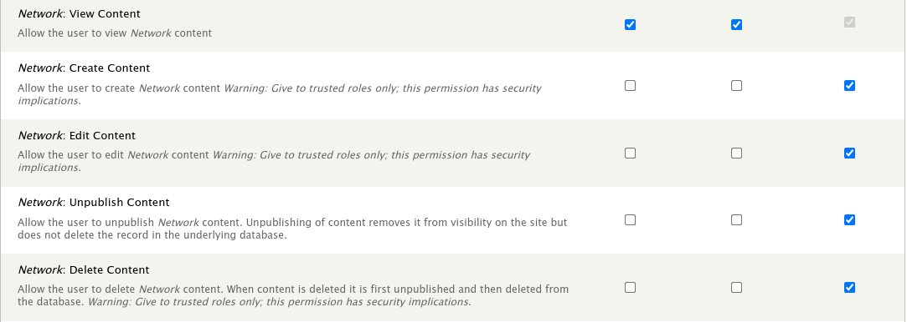

Installation
============

Step 1: Module Installation
---------------------------

The Tripal Network module is available as a full Drupal module.  Therefore, it can be installed following the typical Drupal module installation either via the GUI or via Drush.  We'll do so here using a Drush command:

.. code-block:: bash

  drush pm-enable tripal_network

If you do not have the module already downloaded and available in the `sites/all/modules` folder of your Drupal site, then you will be asked if you would like to download and then enable the module.

The module will create a new 'Network' content type. It will also create the a series of new tables in your Chado database for storing networks.  Additionally, Chado does not have support for metabolic networks, so several new tables will be added for storing compounds, pathways and reactions.  For a full listing of new Chado tables see the :doc:`new_chado_tables` section.

Upon installation you should see the following:

.. code-block:: bash

    $ drush pm-enable tripal_network

    The following extensions will be enabled: tripal_file
    Do you really want to continue? (y/n): y
    INFO (TRIPAL_ENTITIES): Done.
    tripal_network was enabled successfully.                                                           [ok]
    Custom table, 'compound' ,  created successfully.                                                  [status]
    Custom table, 'compoundprop' ,  created successfully.                                              [status]
    Custom table, 'compound_dbxref' ,  created successfully.                                           [status]
    Custom table, 'compound_synonym' ,  created successfully.                                          [status]
    Custom table, 'reaction' , created successfully.                                                   [status]
    Custom table, 'reactionprop' , created successfully.                                               [status]
    Custom table, 'reaction_substrate' , created successfully.                                         [status]
    Custom table, 'reaction_product' , created successfully.                                           [status]
    Custom table, 'pathway' ,  created successfully.                                                   [status]
    Custom table, 'pathwayprop' ,  created successfully.                                               [status]
    Custom table, 'pathway_dbxref' ,  created successfully.                                            [status]
    Custom table, 'pathway_feature' ,  created successfully.                                           [status]
    Custom table, 'network' ,  created successfully.                                                   [status]
    Custom table, 'networkprop' ,  created successfully.                                               [status]
    Custom table, 'network_attr' ,  created successfully.                                              [status]
    Custom table, 'network_attrprop' ,  created successfully.                                          [status]
    Custom table, 'network_cvterm' ,  created successfully.                                            [status]
    Custom table, 'network_file' ,  created successfully.                                              [status]
    Custom table, 'network_node' ,  created successfully.                                              [status]
    Custom table, 'network_nodeprop' ,  created successfully.                                          [status]
    Custom table, 'network_feature' ,  created successfully.                                           [status]
    Custom table, 'network_compound' ,  created successfully.                                          [status]
    Custom table, 'network_edge' ,  created successfully.                                              [status]
    Custom table, 'network_edgeprop' ,  created successfully.                                          [status]
    Custom table, 'network_analysis' ,  created successfully.                                          [status]
    Custom table, 'network_analysisprop' ,  created successfully.                                      [status]
    Custom table, 'network_pub' ,  created successfully.                                               [status]
    Custom table, 'network_layout' ,  created successfully.                                            [status]

Step 2: Set Permissions
-----------------------
Now that the Tripal Network module is installed, we must set permissions so that users can view and or create Network content types.  To set permissions, navigate to **People** page and click the **Permissions** tab in the top right. Look for permissions that begin with prefix `Network:` and set the according to your needs.

.. warning::

  You should not give the anonymous user any permissions other than 'view' permission.
