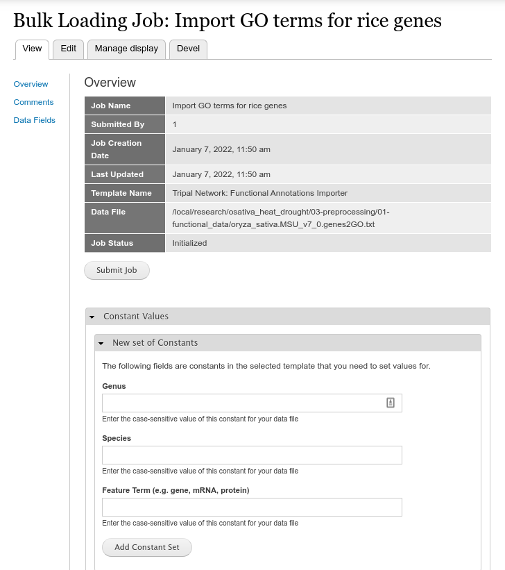

Loading Network Data
=====================

Importing Functional Data
-------------------------
This step is optional and only required if you do not already have functional annotation data for the nodes (i.e., genes, mRNA, proteins) of your network.  Once the tab-delimited file of functional data is created as per the instructions in the :doc:`prepare_data` section, you can import it using the `Chado Bulk Loader <https://tripal.readthedocs.io/en/latest/user_guide/bulk_loader.html>`_.  The Tripal Network module provides a template that supports the tab-delimited format described in the previous section.   To use it, navigate to **Tripal** >> **Data Loaders** >> **Chado Bulk Loader**. You should see the bulk loader page:


Click the **Add Bulk Loading Job** link. The following page appears.


Be sure to give the job a name that makes sense to you, select the Template named **Tripal Network: Functional Annotation Importer**, and then set the full path to your Data File. The Chado Bulk Loaders requires that the file exists on the web server and does not have an upload function.  Once saved you will see the job submission page.



Here you can set the constant values that the template requires. These are the genus and species name to which the features in the file belong, and the feature type.  If these annotations belong to genes then enter 'gene'. If they belong to transcripts, enter 'mRNA' or 'protein' for protein features. Click the **Add Constant Set** button when complete.  You will then see the constant set you just added in a table:


Now, you can click the **Submit Job** button to import the data. The job will be executed in the way your Tripal site is `setup for job execution <https://tripal.readthedocs.io/en/latest/user_guide/install_tripal/automating_job_execution.html>`_.

If you run the job manually on the command-line you will see output similar to the following as the job executes:

.. code::

    Tripal Job Launcher
    Running as user 'administrator'
    -------------------
    2022-01-07 11:58:10: There are 1 jobs queued.
    2022-01-07 11:58:10: Job ID 936.
    2022-01-07 11:58:10: Calling: tripal_bulk_loader_load_data(8)
    Template: Tripal Network: Functional Annotations Importer (10)
    File: /local/research/osativa_heat_drought/03-preprocessing/01-functional_data/oryza_sativa.MSU_v7_0.genes2GO.txt (38000 lines with data)
    Preparing to load...
    Loading...
    Constants:
    	- organism.genus = Oryza
    	- organism.species = sativa
    	- cvterm.name = gene
    	Preparing to load the current constant set...
    		Open File...
    		Start Transaction...
    		Defer Constraints...
    		Acquiring Table Locks...
    			ROW EXCLUSIVE for db
    			ROW EXCLUSIVE for cv
    			ROW EXCLUSIVE for dbxref
    			ROW EXCLUSIVE for cvterm
    			ROW EXCLUSIVE for feature_cvterm
    	Loading the current constant set...
    Progress:
    [||||||||||----------------------------------------] 20.89%. (7938 of 38000) Memory: 39418608

Importing a Network File
------------------------

Step 1: Create a Network
++++++++++++++++++++++++
At this point we should have the "node" data for the network loaded (i.e., genes, mRNA, proteins) as well as any functional annotations.  Before importing the GraphML file we must first create the network page that describes how the network was created.  To do this navigate to **Add Tripal Content** and click the **Network** content type that appears at the bottom in the **Other** section.  The following page appears:


Here you will provide a unique identifier for the network, a name, specify the orginams and specific the type. Examples of network types include:

- Context-specific gene co-expression network (csGCN)
- Gene co-expression network. (GCN)
- Gene regulatory network prediction (GRN)
- Metabolite correlation network. (MCN)
- Protein interaction network prediction (PPI)
- Weighted gene co-expression network analysis (WGCNA)

.. note::

    Chado typically expects a unique computer readable identifier for an entity.  There are no rules what those identifiers should be but often the identifier is a compute readable unique name and the name is a human readable name.

The example screenshot below adds a gene co-expression network created using WGCNA of a `rice dataset exposed to heat and drought <https://academic.oup.com/plcell/article/28/10/2365/6098372>`_. For this example the network page appears as:

 .. image::  ./network_content_type2.png

 Currently, the **Attribute** row in the **Summary** table has an empty drop-down.  We have not yet loaded the network nodes and edges and until then there will be no attributes.

Step 2: Create an Analysis Record
+++++++++++++++++++++++++++++++++
To help ensure provenance most data that is imported into Tripal is associated with an Analysis record.  It is on this record that we will provide the details about how the network was constructed.  To create an analysis record navigate to **Add Tripal Content** and click **Analysis**.

The following example screenshot describes how the network was created.

 .. image::  ./network_analysis_page1.png
 .. image::  ./network_analysis_page2.png

Step 3: Import the GraphML
++++++++++++++++++++++++++

Loader Stage 1
``````````````
After creation of the Network page, the GraphML file can be imported at **Tripal** >> **Data Loaders** >> **Chado GraphML Loader**. This loader uses a multi-stage form.  In the first stage you can upload the GraphML file, set the organism to which the network belongs,


Loader Stage 2
``````````````
The second stage of the loader provides a form to associate controlled vocabulary (CV) terms to each graph, node and edge attribute.  Tripal strives to provide data in a `FAIR <https://www.go-fair.org/fair-principles/>`_ manner. This requires that all attributes be distinguishable using CV terms.  The loader will extract each attribute from the GraphML file and provide a form that you can use to specific a vocabulary term for each attribute.


For networks created using `KINC <https://kinc.readthedocs.io/en/latest/>`_ or which use the example code in the :doc:`prepare_data` section to export a WGCNA network to GraphML then attributes will be recognized automatically and assigned controlled vocabulary terms.  For example, in the screenshot below the term for the **EDGE E_WGCNA_Weight** attribute has already been set by the loader:


Any attributes without an assigned controlled vocabulary term will not be imported with the network.

Loader Stage 3
``````````````
The final stage is naming the graph. Here you provide a human readable name and a unique name. The two can be the same but no two networks can have the same uniquename.


After clicking the **Submit** button, the job for importing the file will be submited to Tripal. The job will be executed in the way your Tripal site is `setup for job execution <https://tripal.readthedocs.io/en/latest/user_guide/install_tripal/automating_job_execution.html>`_.
