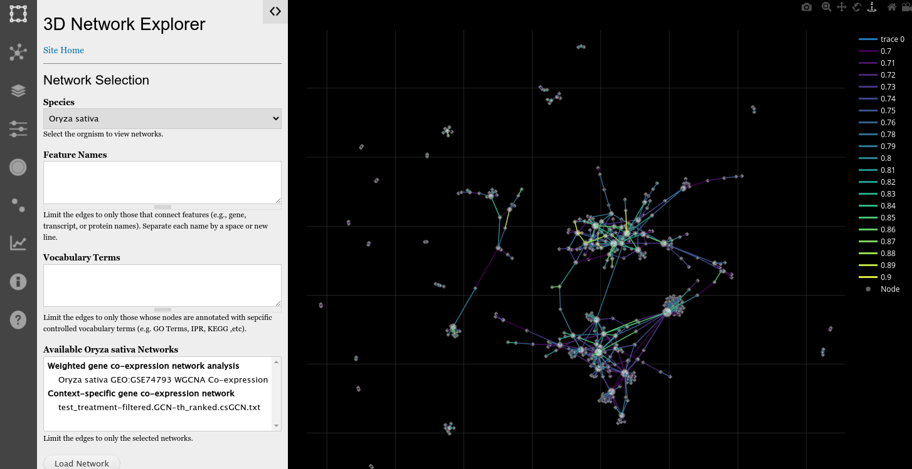

Visualization
=============
There are two ways to visualize network connectivity:

- The neighborhood viewer on a feature page
- The full browser 3D Viewer application

Feature Neighborhood Viewer
---------------------------
The Tripal Network module provides a field that can be added to feature pages (e.g. genes, mRNA, protein pages). You must first enable the viewer for each feature type on which you want it to appear.  To do this navigate to the **Structure** >> **Tripal Content Types** and select the content type of the nodes in your network.  If the nodes are genes, then click the **manage fields** link for the **Gene** content type.  When the paeg appears, click the **Check for new fields** link at the top of the page:

Next, click the **Manage Display** tab to place the field where you would like it to appeqar on the page.  See the `Configuring Page Layout <https://tripal.readthedocs.io/en/latest/user_guide/content_types/configuring_page_display.html>`_ documentation in the Tripal User's Guide for instructions on organizing fields on a page.

Once the field has been organized and placed, you can then open any feature page that serves as a node in your network and see an interactive 3D viewer of the neighborhood of connections for that feature.

Site visitors will be able to view the connections for each network that is loaded.  The features are limited for this view, but a link titled **Explore the full network** is available that, when clicked, will take the user to the full browser 3D Network Exploration App.

The 3D Network Exploration App
------------------------------
A Tripal site that has the Tripal Network module installed will have available the 3D Network Explorer app. It is available at the relative URL ``/networks/viewer`` of your website.  When the user first arrives the 3D viewer has a left-sidebar with controls and a blank exploration window to the right:

The icon bar on the far left provides the following functionality in order of appearance from top to bottom:

- Network Selection
- Network Details
- 3D Layers
- Property Filters
- Node Details
- Edge Details
- Analyses
- Information
- Help

Network Selection
+++++++++++++++++
By default, the network selection sidebar is open when the 3D viewer first appears. Here  the user selects a network by selecting the species and clicking the **Load Network** button. Only species that have imported networks will be available in the list.  The user can limit the network to a specific set of features (nodes) or controlled vocabulary terms such as Gene Ontology terms that are assigned to the nodes.

By default the network loaded will only include 500 of the top edges.  This number can be changed in the property filters sidebar.

Interactive Network Exploration
+++++++++++++++++++++++++++++++
The exploration window provides a control panel in the top right corner:

The control panel supports the following in order of the icons that appear:

- Download screenshot of the network
- Zoom in or out
- Pan right, left up or down
- Orbital rotate
- Turntable rotation
- Reset camera

Zooming, panning and rotating are also available with the mouse:

- zooming:  mouse wheel
- rotation: left-click and drag
- panning: right-click and drag

By rotating, the end user can explore in the Z-axis (3rd dimension) a stacked layout of edges for an attribute.  The following screenshot shows the network stacked by correlation values, where those colored more brightly and near the top are more highly correlated.

Users can explore the attributes of nodes and edges by clicking on either. If a node is clicked then the Node Details sidebar is opened. If an edge is clicked then the Edge Details sidebar is opened.
